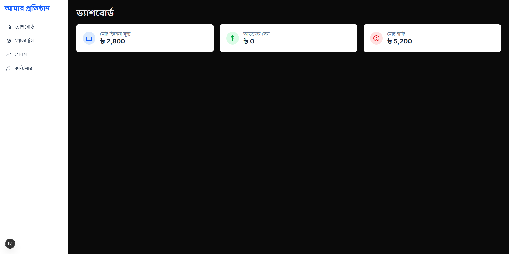
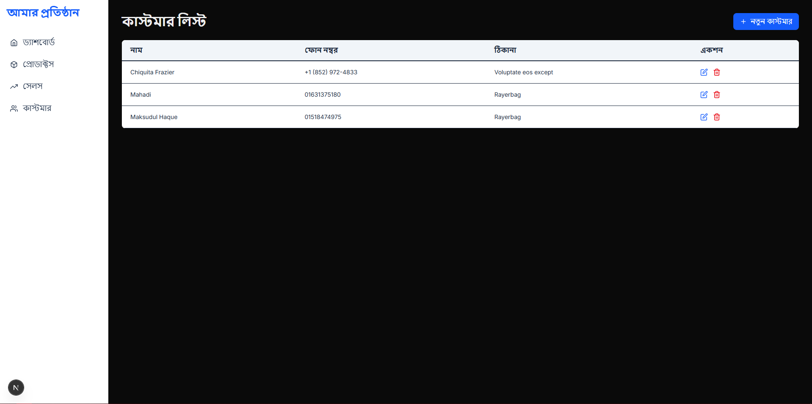

# Smart Inventory - A Full-Stack Inventory Management Solution

<div align="center">
  
</div>

Smart Inventory is a modern, fast, and user-friendly web application designed for small to medium-sized businesses. It provides a comprehensive solution for managing product inventory, tracking sales, and handling customer dues efficiently.

[](https://vercel.com/new/clone?repository-url=https%3A%2F%2Fgithub.com%2Fmaksudulhaque2000%2FMy_Inventory)

---

## 📸 Screenshots

Here are a few snapshots of the application in action.

| Dashboard                                    | Products Page                               | New Sale Form                              |
| ------------------------------------------ | --------------------------------------------- | --------------------------------------------- |
|  |  |  |  |

*(Note: You can create a `screenshots` folder in your project's root and place the corresponding images there.)*

## ✨ Features

-   **📊 Analytical Dashboard:** Get a quick overview of your business with key metrics like Today's Sales, Total Dues, and Total Stock Value.
-   **📦 Product Management (CRUD):**
    -   Full capabilities to Add, View, Edit, and Delete products.
    -   Real-time tracking of product quantities: Imported, Sold, and current Stock.
-   **👥 Customer Management (CRUD):**
    -   Add new customers with details like name, phone, and address.
    -   Edit and Delete existing customer information with a modern, toast-based confirmation.
-   **📈 Sales Tracking:**
    -   An intuitive form to record new sales, complete with searchable dropdowns for products and customers.
    -   Flexibility to add new customers directly from the sales form.
    -   Track the payment status of each sale (Paid/Due).
-   **🚀 Modern UI/UX:**
    -   A clean, fast, and responsive design built for efficiency.
    -   User-friendly toast notifications for feedback on all operations.
    -   Easy navigation with a persistent sidebar.

## 🛠️ Tech Stack

-   **Framework:** [Next.js](https://nextjs.org/) (with App Router)
-   **Language:** [TypeScript](https://www.typescriptlang.org/)
-   **Database:** [MongoDB](https://www.mongodb.com/) (with [Mongoose](https://mongoosejs.com/))
-   **Styling:** [Tailwind CSS](https://tailwindcss.com/)
-   **UI Components:** [Headless UI](https://headlessui.com/) (for searchable dropdowns)
-   **Notifications:** [React Hot Toast](https://react-hot-toast.com/)
-   **Icons:** [React Icons](https://react-icons.github.io/react-icons/)
-   **Deployment:** [Vercel](https://vercel.com/)

## 🚀 Getting Started

Follow these instructions to get a copy of the project up and running on your local machine.

### Prerequisites

-   [Node.js](https://nodejs.org/en/) (v18.0 or higher recommended)
-   [MongoDB](https://www.mongodb.com/try/download/community) account (a free Atlas cluster is a great choice)

### Installation

1.  **Clone the repository:**
    ```bash
    git clone [https://github.com/maksudulhaque2000/My_Inventory.git](https://github.com/maksudulhaque2000/My_Inventory.git)
    ```

2.  **Navigate to the project directory:**
    ```bash
    cd My_Inventory
    ```

3.  **Install NPM packages:**
    ```bash
    npm install
    ```

4.  **Set up environment variables:**
    Create a `.env.local` file in the root of your project and add the necessary variables as shown in the `.env.example` file.

## 🔑 Environment Variables

To run this project, you will need to add the following environment variables to your `.env.local` file:

```env
MONGODB_URI="your_mongodb_connection_string"
NEXT_PUBLIC_API_URL="http://localhost:3000"
MONGODB_URI: Your connection string for the MongoDB database.
NEXT_PUBLIC_API_URL: Use http://localhost:3000 for local development. For production, this should be your public deployment URL.
```

## 📜 Available Scripts

In the project directory, you can run:
* ```npm run dev``` : Starts the development server.
* ```npm run build``` : Builds the app for production.
* ```npm run start```: Runs the built app in production mode.

## 🌐 Deployment

This application is optimized for deployment on Vercel.

1.  **Push your project to a GitHub repository.**
2.  **Log in to Vercel and import your project from the repository.**
3.  **In the project settings, navigate to the "Environment Variables" section and add your MONGODB_URI and the production NEXT_PUBLIC_API_URL.**
4.  **Click "Deploy". Vercel will handle the rest.**

---

<p align="center">
  <strong>Empowering Small Businesses with Smart Inventory Control.</strong>
</p>
<p align="center">
  Built with ❤️ for business owners.
</p>
<p align="center">
  Licensed under the MIT License. © 2025 Maksudul Haque.
</p>
