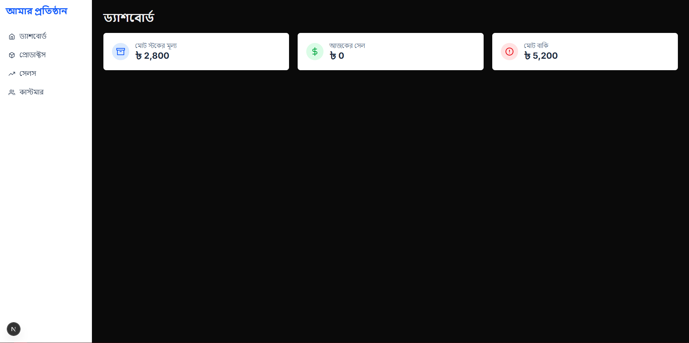
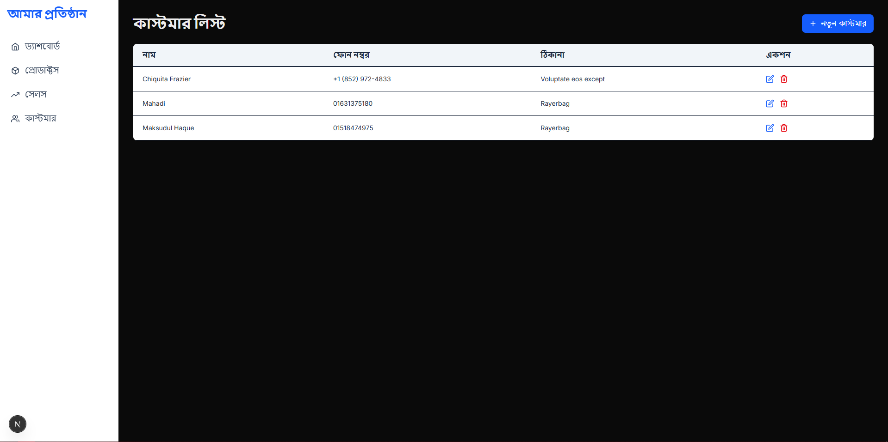

<h1 align="center">My Inventory - Smart Inventory Management System</h1>

<div align="center">
  
</div>

<p align="center">
  A modern inventory management web application built with Next.js, MongoDB, and Mongoose for managing products, customers, and sales from a clean dashboard.
</p>

<p align="center">
  <a href="https://my-inventory-puce.vercel.app/" target="_blank" rel="noreferrer"></a>
  <a href="https://github.com/maksudulhaque2000/My_Inventory" target="_blank" rel="noreferrer"></a>
  <a href="https://maksudul-haque.vercel.app/" target="_blank" rel="noreferrer"></a>
</p>

<p align="center">
  <a href="https://www.linkedin.com/in/maksudulhaque2000/" target="_blank" rel="noreferrer"></a>
  <a href="https://www.facebook.com/maksudulhaque2000" target="_blank" rel="noreferrer"></a>
  <a href="https://www.youtube.com/@maksudulhaque2000" target="_blank" rel="noreferrer"></a>
  <a href="https://github.com/maksudulhaque2000" target="_blank" rel="noreferrer"></a>
</p>

---

## Overview

My Inventory is a full-stack inventory management system designed to help small and medium businesses track stock, manage customer data, and record sales in one place. The application includes a dashboard for quick business insights, CRUD workflows for products and customers, and a sales module with stock validation and payment status tracking.

The application uses the Next.js App Router architecture with API routes, MongoDB for persistence, and Mongoose models for structured data access. The UI is responsive, toast-driven, and optimized for practical day-to-day operations.

## Live Links

- Live App: https://my-inventory-puce.vercel.app/
- GitHub Repository: https://github.com/maksudulhaque2000/My_Inventory
- Portfolio: https://maksudul-haque.vercel.app/
- LinkedIn: https://www.linkedin.com/in/maksudulhaque2000/
- Facebook: https://www.facebook.com/maksudulhaque2000
- YouTube: https://www.youtube.com/@maksudulhaque2000
- GitHub Profile: https://github.com/maksudulhaque2000

## Key Features

- Dashboard with business summary cards for total stock value, today's sales, and total due amount.
- Product management with create, edit, delete, and stock-aware listing.
- Customer management with create, edit, delete, and optional address support.
- Sales management with searchable product and customer selection.
- Automatic sale total calculation based on product price and selected quantity.
- Stock validation before sale creation to prevent overselling.
- Payment status tracking with Paid and Due states.
- Toast notifications for success, error, loading, and confirmation flows.
- Modal-based forms for a cleaner and more focused user experience.
- MongoDB-backed persistent data layer with Mongoose models.

## Tech Stack

- Frontend: Next.js 15, React 19, TypeScript
- Styling: Tailwind CSS 4
- Database: MongoDB
- ODM: Mongoose
- UI Utilities: React Icons, React Hot Toast, Headless UI, clsx

## Project Structure

```text
src/
  app/
    api/                # REST API routes for customers, products, sales, and dashboard summary
    customers/          # Customer management page
    products/           # Product management page
    sales/               # Sales management page
    layout.tsx          # Global layout and sidebar navigation
    page.tsx            # Dashboard page
  components/           # Reusable forms, modal, dropdown, spinner
  lib/                  # Database connection and dashboard service
  models/               # Mongoose schemas for Product, Customer, and Sale
public/                 # Preview and page screenshots
```

## Pages and Workflows

### Dashboard

The dashboard is server-rendered on each request and displays three core metrics:

- Total stock value
- Today's sales total
- Total due amount

### Products

The products page lets you:

- Add a new product with name, import quantity, and price.
- Edit existing products.
- Delete products with confirmation.
- View live stock, sold quantity, and unit price.

### Customers

The customers page lets you:

- Add a customer with name, phone number, and optional address.
- Edit customer details.
- Delete customers with confirmation.
- Manage unique phone-based customer records.

### Sales

The sales page lets you:

- Record a sale by selecting a product and customer.
- Search products and customers from dropdowns.
- Set quantity and payment status.
- Prevent sales that exceed available stock.
- Automatically calculate total sale value.

## API Overview

All routes return JSON responses in a consistent format with a `success` flag and either `data` or `error`.

### Dashboard Summary

- `GET /api/dashboard-summary`

Returns dashboard totals for stock value, today's sales, and due amount.

### Products

- `GET /api/products`
- `POST /api/products`
- `GET /api/products/:id`
- `PUT /api/products/:id`
- `DELETE /api/products/:id`

### Customers

- `GET /api/customers`
- `POST /api/customers`
- `PUT /api/customers/:id`
- `DELETE /api/customers/:id`

### Sales

- `GET /api/sales`
- `POST /api/sales`

## Data Models

### Product

- `name`: unique product name
- `importQuantity`: total imported stock
- `price`: unit price
- timestamps

### Customer

- `name`: customer name
- `phone`: unique phone number
- `address`: optional address field
- timestamps

### Sale

- `product`: reference to Product
- `customer`: reference to Customer
- `quantity`: quantity sold
- `totalPrice`: computed sale total
- `paymentStatus`: Paid or Due
- `saleDate`: sale timestamp

## Environment Variables

Create a `.env.local` file in the project root and add your MongoDB connection string:

```bash
MONGODB_URI=your_mongodb_connection_string
```

## Getting Started

### Prerequisites

- Node.js 18 or later
- npm, pnpm, or yarn
- MongoDB database or MongoDB Atlas cluster

### Installation

```bash
git clone https://github.com/maksudulhaque2000/My_Inventory.git
cd My_Inventory
npm install
```

### Run Locally

```bash
npm run dev
```

Open `http://localhost:3000` in your browser.

### Build for Production

```bash
npm run build
npm run start
```

### Lint the Project

```bash
npm run lint
```

## Screenshots

<div align="center">
  
  <br /><br />
  
  <br /><br />
  
  <br /><br />
  
</div>

## Implementation Notes

- The dashboard page uses a dedicated service layer for summary calculations.
- Product stock is derived from imported quantity minus sold quantity.
- Sales creation validates available stock before saving a record.
- Customer phone numbers are enforced as unique in the database.
- The UI uses modal dialogs and toast notifications to keep the workflow fast and readable.
- The app currently presents its interface labels in Bengali, while this README is maintained in English for broader project documentation.

## Author

Maksudul Haque

## Contact

- Portfolio: https://maksudul-haque.vercel.app/
- LinkedIn: https://www.linkedin.com/in/maksudulhaque2000/
- Facebook: https://www.facebook.com/maksudulhaque2000
- YouTube: https://www.youtube.com/@maksudulhaque2000
- GitHub: https://github.com/maksudulhaque2000
